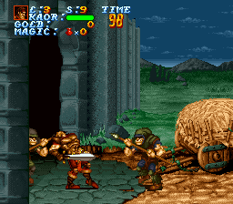

# LEGEND – Copy Protection Mechanism & ARP Cheating
**Software reverse engineering by Ramsis a.k.a. ManuLöwe, August 2022**


The SNES game _Legend_ by Arcade Zone Ltd./Seika Corporation implements a rather elaborate copy protection mechanism designed to prevent the use of an Action Replay cheat device, playing the game on a copier, and/or playing it on a SNES console from another region. (On a side note, using a Game Genie should be fine as this device only ever modifies ROM data, not RAM, and therefore won't interfere with CPU exception vectors and such.)

During the boot process, the vertical display frequency is determined via the `STAT78` register (`$213F`). Bit 4 is kept and shifted right four times (to bit 0). Finally, a resulting 16-bit value of `$0001` (50 Hz) or `$0000` (60 Hz) is stored to DP location `$2D` (zeroing out `$2E` in both cases) for the purpose of subsequent checks.


Tracelog PAL version:

```
8080ac lda $213f      [82213f] A:0080 X:0220 Y:0000 S:01ff D:0000 DB:82 N.M..I.C V: 95 H: 90 F:12
8080af and #$10                A:0033 X:0220 Y:0000 S:01ff D:0000 DB:82 ..M..I.C V: 95 H: 96 F:12
8080b1 lsr                     A:0010 X:0220 Y:0000 S:01ff D:0000 DB:82 ..M..I.C V: 95 H: 99 F:12
8080b2 lsr                     A:0008 X:0220 Y:0000 S:01ff D:0000 DB:82 ..M..I.. V: 95 H:102 F:12
8080b3 lsr                     A:0004 X:0220 Y:0000 S:01ff D:0000 DB:82 ..M..I.. V: 95 H:105 F:12
8080b4 lsr                     A:0002 X:0220 Y:0000 S:01ff D:0000 DB:82 ..M..I.. V: 95 H:108 F:12
8080b5 rep #$20                A:0001 X:0220 Y:0000 S:01ff D:0000 DB:82 ..M..I.. V: 95 H:111 F:12
8080b7 and #$00ff              A:0001 X:0220 Y:0000 S:01ff D:0000 DB:82 .....I.. V: 95 H:115 F:12
8080ba sta $2d        [00002d] A:0001 X:0220 Y:0000 S:01ff D:0000 DB:82 .....I.. V: 95 H:120 F:12
```

Tracelog US version:

```
8080ac lda $213f      [82213f] A:0080 X:0220 Y:0000 S:01ff D:0000 DB:82 N.M..I.C V:171 H: 97 F:14
8080af and #$10                A:0023 X:0220 Y:0000 S:01ff D:0000 DB:82 ..M..I.C V:171 H:103 F:14
8080b1 lsr                     A:0000 X:0220 Y:0000 S:01ff D:0000 DB:82 ..M..IZC V:171 H:106 F:14
8080b2 lsr                     A:0000 X:0220 Y:0000 S:01ff D:0000 DB:82 ..M..IZ. V:171 H:109 F:14
8080b3 lsr                     A:0000 X:0220 Y:0000 S:01ff D:0000 DB:82 ..M..IZ. V:171 H:112 F:14
8080b4 lsr                     A:0000 X:0220 Y:0000 S:01ff D:0000 DB:82 ..M..IZ. V:171 H:115 F:14
8080b5 rep #$20                A:0000 X:0220 Y:0000 S:01ff D:0000 DB:82 ..M..IZ. V:171 H:118 F:14
8080b7 and #$00ff              A:0000 X:0220 Y:0000 S:01ff D:0000 DB:82 .....IZ. V:171 H:122 F:14
8080ba sta $2d        [00002d] A:0000 X:0220 Y:0000 S:01ff D:0000 DB:82 .....IZ. V:171 H:127 F:14
```

(BTW, the developers could have omitted the `AND #$10` instruction and instead replace the `AND #$00FF` with `AND #$0001`, but what do I know.)

In case you thought, "well, that was lame," buckle up for what comes next ...


The routine that performs all of the other checks lives at `$(80)80E2` – conveniently, the address is the same in both the PAL and the US ROM.

This routine isn't called just once but *every time*

- when a level starts, after the level name is displayed and the game waits for a button press (i.e. right before the "sword window" screen transition from black),
- when a level has been completed (right after the "sword window" screen transition to black),
- and sometimes even in between sections of a level. (This is particularly annoying as you need to quickly move the ARP's switch to the middle position (off) as soon as the game takes control of your character and makes him walk off-screen, or else your attempt to save the kingdom of Sellech by means of cheating will be thwarted immediately. :wink:


The routine checks if

- CPU exception vectors (`$00FE00-$00FFFF`) are intact (ARP patches the NMI vector when codes are enabled)
- the DP variable `$2D` still contains the expected value (see above), depending on the region of the game
- SRAM is present/visible (as it would be on earlier copier models) by writing and reading two 16-bit values (`$0102` and, if it reads back correctly, `$0201`) to/from `$770000` using indirect addressing, possibly to somewhat hide the fact that SRAM is accessed at all. What's especially puzzling is how the SRAM bank byte gets put together ...

Lastly, a 16-bit result (`$0000` when no "violation" is found, otherwise `$0001`) is stored to variable `$0200`, which is then checked to determine if gameplay should end, resulting in the dreaded **THIS GAME PAK IS NOT DESIGNED FOR YOUR SUPER FAMICOM OR SUPER NES** message.


Tracelog/disassembly of routine:

```
[PAL]   809853 jsr $80e2      [8080e2] A:00ff X:0000 Y:0014 S:01fc D:0000 DB:82 .....I.. V:232 H: 79 F: 0
[US]    809850 jsr $80e2      [8080e2] A:0000 X:0010 Y:0098 S:01fc D:0000 DB:82 .....IZC V:249 H:122 F:32

[both]  8080e2 php                     A:00ff X:0000 Y:0014 S:01fa D:0000 DB:82 .....I.. V:232 H: 89 F: 0
        8080e3 phb                     A:00ff X:0000 Y:0014 S:01f9 D:0000 DB:82 .....I.. V:232 H: 94 F: 0
        8080e4 sep #$20                A:00ff X:0000 Y:0014 S:01f8 D:0000 DB:82 .....I.. V:232 H: 99 F: 0

; make data bank = $00
        8080e6 lda #$00                A:00ff X:0000 Y:0014 S:01f8 D:0000 DB:82 ..M..I.. V:232 H:104 F: 0
        8080e8 pha                     A:0000 X:0000 Y:0014 S:01f8 D:0000 DB:82 ..M..IZ. V:232 H:107 F: 0
        8080e9 plb                     A:0000 X:0000 Y:0014 S:01f7 D:0000 DB:82 ..M..IZ. V:232 H:112 F: 0

; zero out "cheater status" variable for now
        8080ea rep #$30                A:0000 X:0000 Y:0014 S:01f8 D:0000 DB:00 ..M..IZ. V:232 H:118 F: 0
        8080ec stz $0200      [000200] A:0000 X:0000 Y:0014 S:01f8 D:0000 DB:00 .....IZ. V:232 H:123 F: 0

; check COP vector, branch to player's doom if it's been tampered with
        8080ef lda #$80dd              A:0000 X:0000 Y:0014 S:01f8 D:0000 DB:00 .....IZ. V:232 H:131 F: 0
        8080f2 cmp $ffe4      [00ffe4] A:80dd X:0000 Y:0014 S:01f8 D:0000 DB:00 N....I.. V:232 H:146 F: 0
        8080f5 bne $8166      [808166] A:80dd X:0000 Y:0014 S:01f8 D:0000 DB:00 .....IZC V:232 H:154 F: 0

; check BRK vector, branch to player's doom if it's been tampered with
        8080f7 lda #$0000              A:80dd X:0000 Y:0014 S:01f8 D:0000 DB:00 .....IZC V:232 H:157 F: 0
        8080fa cmp $ffe6      [00ffe6] A:0000 X:0000 Y:0014 S:01f8 D:0000 DB:00 .....IZC V:232 H:162 F: 0
        8080fd bne $8166      [808166] A:0000 X:0000 Y:0014 S:01f8 D:0000 DB:00 .....IZC V:232 H:170 F: 0

; check ABORT vector, branch to player's doom if it's been tampered with
        8080ff lda #$80dd              A:0000 X:0000 Y:0014 S:01f8 D:0000 DB:00 .....IZC V:232 H:173 F: 0
        808102 cmp $ffe8      [00ffe8] A:80dd X:0000 Y:0014 S:01f8 D:0000 DB:00 N....I.C V:232 H:178 F: 0
        808105 bne $8166      [808166] A:80dd X:0000 Y:0014 S:01f8 D:0000 DB:00 .....IZC V:232 H:186 F: 0

; check NMI vector, branch to player's doom if it's been tampered with (this is most likely how it detects the ARP whenever cheats are enabled)
        808107 lda #$80de              A:80dd X:0000 Y:0014 S:01f8 D:0000 DB:00 .....IZC V:232 H:189 F: 0
        80810a cmp $ffea      [00ffea] A:80de X:0000 Y:0014 S:01f8 D:0000 DB:00 N....I.C V:232 H:194 F: 0
        80810d bne $8166      [808166] A:80de X:0000 Y:0014 S:01f8 D:0000 DB:00 .....IZC V:232 H:202 F: 0

; check IRQ vector, branch to player's doom if it's been tampered with
        80810f lda #$80dd              A:80de X:0000 Y:0014 S:01f8 D:0000 DB:00 .....IZC V:232 H:205 F: 0
        808112 cmp $ffee      [00ffee] A:80dd X:0000 Y:0014 S:01f8 D:0000 DB:00 N....I.C V:232 H:210 F: 0
        808115 bne $8166      [808166] A:80dd X:0000 Y:0014 S:01f8 D:0000 DB:00 .....IZC V:232 H:218 F: 0

; check 6502 emulation mode COP vector, branch to player's doom if it's been tampered with
        808117 lda #$80dd              A:80dd X:0000 Y:0014 S:01f8 D:0000 DB:00 .....IZC V:232 H:221 F: 0
        80811a cmp $fff4      [00fff4] A:80dd X:0000 Y:0014 S:01f8 D:0000 DB:00 N....I.C V:232 H:226 F: 0
        80811d bne $8166      [808166] A:80dd X:0000 Y:0014 S:01f8 D:0000 DB:00 .....IZC V:232 H:234 F: 0

; check 6502 emulation mode ABORT vector (unused on the SNES), branch to player's doom if it's been tampered with
        80811f lda #$80dd              A:80dd X:0000 Y:0014 S:01f8 D:0000 DB:00 .....IZC V:232 H:237 F: 0
        808122 cmp $fff8      [00fff8] A:80dd X:0000 Y:0014 S:01f8 D:0000 DB:00 N....I.C V:232 H:242 F: 0
        808125 bne $8166      [808166] A:80dd X:0000 Y:0014 S:01f8 D:0000 DB:00 .....IZC V:232 H:250 F: 0

; check 6502 emulation mode NMI vector, branch to player's doom if it's been tampered with
        808127 lda #$80dd              A:80dd X:0000 Y:0014 S:01f8 D:0000 DB:00 .....IZC V:232 H:253 F: 0
        80812a cmp $fffa      [00fffa] A:80dd X:0000 Y:0014 S:01f8 D:0000 DB:00 N....I.C V:232 H:258 F: 0
        80812d bne $8166      [808166] A:80dd X:0000 Y:0014 S:01f8 D:0000 DB:00 .....IZC V:232 H:266 F: 0

; check RESET vector, branch to player's doom if it's been tampered with
        80812f lda #$8019              A:80dd X:0000 Y:0014 S:01f8 D:0000 DB:00 .....IZC V:232 H:269 F: 0
        808132 cmp $fffc      [00fffc] A:8019 X:0000 Y:0014 S:01f8 D:0000 DB:00 N....I.C V:232 H:274 F: 0
        808135 bne $8166      [808166] A:8019 X:0000 Y:0014 S:01f8 D:0000 DB:00 .....IZC V:232 H:282 F: 0

; check 6502 emulation mode IRQ/BRK vector, branch to player's doom if it's been tampered with
        808137 lda #$80dd              A:8019 X:0000 Y:0014 S:01f8 D:0000 DB:00 .....IZC V:232 H:285 F: 0
        80813a cmp $fffe      [00fffe] A:80dd X:0000 Y:0014 S:01f8 D:0000 DB:00 N....I.C V:232 H:290 F: 0
        80813d bne $8166      [808166] A:80dd X:0000 Y:0014 S:01f8 D:0000 DB:00 .....IZC V:232 H:298 F: 0

; check DP variable containing console region, branch to player's doom if the value is wrong
        80813f lda $2d        [00002d] A:80dd X:0000 Y:0014 S:01f8 D:0000 DB:00 .....IZC V:232 H:301 F: 0
[PAL]   808141 beq $8166      [808166] A:0001 X:0000 Y:0014 S:01f8 D:0000 DB:00 .....I.C V:232 H:308 F: 0
[US]    808141 bne $8166      [808166] A:0000 X:0010 Y:0098 S:01f8 D:0000 DB:00 .....IZC V:250 H: 59 F:32

; prepare indirect SRAM address for writing/reading (with some hilarious bank byte "calculation" using immediate values, possibly to obfuscate SRAM access)
[both]  808143 stz $00        [000000] A:0001 X:0000 Y:0014 S:01f8 D:0000 DB:00 .....I.C V:232 H:311 F: 0
        808145 lda #$0060              A:0001 X:0000 Y:0014 S:01f8 D:0000 DB:00 .....I.C V:232 H:318 F: 0
        808148 clc                     A:0060 X:0000 Y:0014 S:01f8 D:0000 DB:00 .....I.C V:232 H:323 F: 0
        808149 adc #$0017              A:0060 X:0000 Y:0014 S:01f8 D:0000 DB:00 .....I.. V:232 H:325 F: 0
        80814c sta $02        [000002] A:0077 X:0000 Y:0014 S:01f8 D:0000 DB:00 .....I.. V:232 H:329 F: 0

; write $0102 to SRAM region, branch to safety if it fails to read back
        80814e lda #$0102              A:0077 X:0000 Y:0014 S:01f8 D:0000 DB:00 .....I.. V:232 H:336 F: 0
        808151 sta [$00]      [770000] A:0102 X:0000 Y:0014 S:01f8 D:0000 DB:00 .....I.. V:233 H:  1 F: 0
        808153 lda [$00]      [770000] A:0102 X:0000 Y:0014 S:01f8 D:0000 DB:00 .....I.. V:233 H: 14 F: 0
        808155 cmp #$0102              A:7777 X:0000 Y:0014 S:01f8 D:0000 DB:00 .....I.. V:233 H: 27 F: 0
        808158 bne $816c      [80816c] A:7777 X:0000 Y:0014 S:01f8 D:0000 DB:00 .....I.C V:233 H: 31 F: 0

; it worked, so write $0201 to the same SRAM region to really make sure SRAM is present (IOW, the game is likely running on a copier), branch to safety if it fails to read back once more
        80815a lda #$0201              A:7777 X:0000 Y:001e S:01f8 D:0000 DB:00 .....I.C V:232 H:199 F: 8
        80815d sta [$00]      [770000] A:0201 X:0000 Y:001e S:01f8 D:0000 DB:00 .....I.C V:232 H:204 F: 8
        80815f lda [$00]      [770000] A:0201 X:0000 Y:001e S:01f8 D:0000 DB:00 .....I.C V:232 H:217 F: 8
        808161 cmp #$0201              A:7777 X:0000 Y:001e S:01f8 D:0000 DB:00 .....I.C V:232 H:230 F: 8
        808164 bne $816c      [80816c] A:7777 X:0000 Y:001e S:01f8 D:0000 DB:00 .....I.C V:232 H:234 F: 8

; player's doom: store $0001 to "cheater status" variable
        808166 lda #$0001              A:0000 X:0000 Y:0018 S:01f8 D:0000 DB:00 .....IZC V:232 H: 69 F:57
        808169 sta $0200      [000200] A:0001 X:0000 Y:0018 S:01f8 D:0000 DB:00 .....I.C V:232 H: 73 F:57

; safety (all checks passed without issue) or done: end routine
        80816c plb                     A:7777 X:0000 Y:0014 S:01f8 D:0000 DB:00 .....I.C V:233 H: 36 F: 0
        80816d plp                     A:7777 X:0000 Y:0014 S:01f9 D:0000 DB:82 N....I.C V:233 H: 42 F: 0
        80816e rts                     A:7777 X:0000 Y:0014 S:01fa D:0000 DB:82 .....I.. V:233 H: 49 F: 0

; back from routine, check "cheater status" variable
[PAL]   809856 lda $0200      [820200] A:7777 X:0000 Y:0014 S:01fc D:0000 DB:82 .....I.. V:233 H: 59 F: 0
        809859 beq $985e      [80985e] A:0000 X:0000 Y:0014 S:01fc D:0000 DB:82 .....IZ. V:233 H: 67 F: 0
[US]    809853 lda $0200      [820200] A:7777 X:0010 Y:0098 S:01fc D:0000 DB:82 .....IZC V:250 H:175 F:32
        809856 beq $985b      [80985b] A:0000 X:0010 Y:0098 S:01fc D:0000 DB:82 .....IZC V:250 H:185 F:32

; cheater alert ... and punishment!
[PAL]   80985b 4C F7 88 = jmp $88F7 --> "THIS GAME PAK IS NOT DESIGNED ..."
[US]    809858 4C 1E 8A = jmp $8A1E --> "THIS GAME PAK IS NOT DESIGNED ..."

; no cheating attempts detected, continue game normally
[PAL]   80985e jsr $f359      [80f359] A:0000 X:0000 Y:0014 S:01fc D:0000 DB:82 .....IZ. V:233 H: 72 F: 0
[US]    80985b jsr $f39a      [80f39a] A:0000 X:0010 Y:0098 S:01fc D:0000 DB:82 .....IZC V:250 H:190 F:32
```

Whew!

Now, in theory, there are multiple options to defeat this. A one-byte fix is mandatory so as to minimize ARP code input work. :wink: The simplest and most obvious option would be to replace the first byte in the subroutine with an `RTS` instruction (ARP ROM code: `8080E260`), thus bypassing it entirely. This, however, would rely upon WRAM, particularly bytes `$0200` and `$0201` having been zeroed-out at some point (and not been modified afterwards) before the routine is called, which I haven't verified. (Putting the `RTS` right after the "cheater status" variable gets zeroed within the routine won't work because the stack contains unrelated data at this point.)
Replacing the branch-if-zero instruction in the "cheater status" check after the subroutine with a branch-always instruction would definitely work, but require a different code for each region release of the game (PAL and US).
Also note that a RAM cheat keeping the "cheater status" variable at a value of zero, like `7E020000` or `00020000`, won't work in this scenario at all, likely because NMI/IRQ is disabled at the time the variable is checked. (Yeah, the developers really went out of their way to stop people from messing about ... :wink:)

So, the easiest and probably most elegant way to do it is to write zero to the "cheater status" variable in the "player's doom" section close to the end of the routine, making the game "forget" that if at all, any manipulation whatsoever has been detected.

ARP ROM code : `80816700` (to be entered before any RAM code)

GG equivalent: `DD61-1FAD`

In case it isn't obvious, these codes work on both the PAL and the US release of the game. :grinning:



That's all, folks.

### © 2022 by Ramsis/ManuLöwe | https://github.com/Ramsis-SNES/
